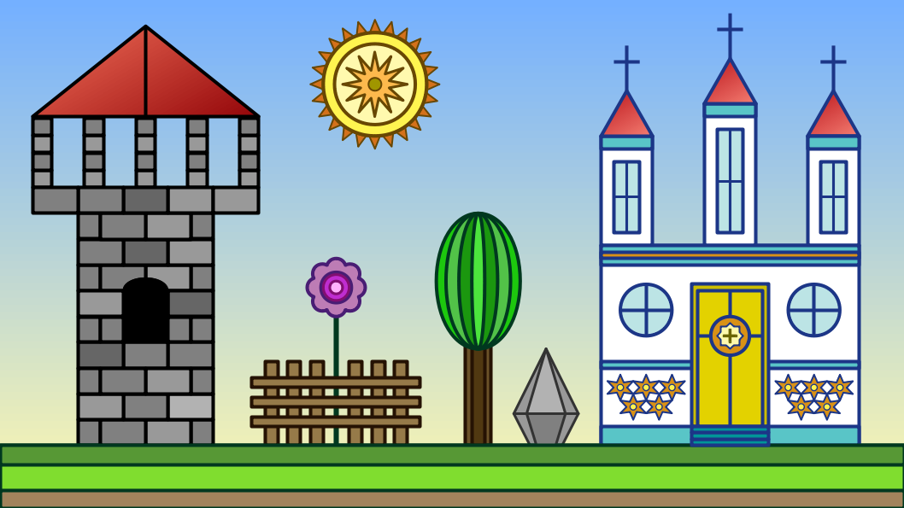

# Desenvolvimento de Games 2D com JavaScript

Projeto educativo que propõe o ensino da programação através da construção de vídeo-games 2D.

## Conteúdo

- [Tecnologias Usadas](https://github.com/the-akira/JavaScriptGameDev/blob/master/Material/Tecnologias.md)
- [Fundamentos](https://github.com/the-akira/JavaScriptGameDev/tree/master/Fundamentals)
- [Exercícios](https://github.com/the-akira/JavaScriptGameDev/tree/master/Exercises)
- [Material Didático](https://github.com/the-akira/JavaScriptGameDev/blob/master/Material/Introduction.pdf)
- [Exemplos Práticos](https://github.com/the-akira/JavaScriptGameDev/tree/master/Material/Exemplos)
- [Roteiro Completo](https://roteirogamedev.netlify.app/)
- [Aventura JS](https://jsquest.netlify.app/)

## Games Criados

- [A Jornada de Ismael](https://github.com/the-akira/JavaScriptGameDev/tree/master/Games/A%20Jornada%20de%20Ismael)
- [Alpha Wings](https://github.com/the-akira/JavaScriptGameDev/tree/master/Games/Alpha%20Wings)
- [Conway's Game of Life](https://github.com/the-akira/JavaScriptGameDev/tree/master/Games/Game%20of%20Life)
- [Elder Dragon](https://github.com/the-akira/JavaScriptGameDev/tree/master/Games/Elder%20Dragon)
- [RPG Prototype](https://github.com/the-akira/JavaScriptGameDev/tree/master/Games/RPG%20Prototype)
- [Shadow Templar](https://github.com/the-akira/JavaScriptGameDev/tree/master/Games/Shadow%20Templar)
- [Sistema de Coordenadas](https://github.com/the-akira/JavaScriptGameDev/tree/master/Games/Sistema%20de%20Coordenadas)
- [Snake](https://github.com/the-akira/JavaScriptGameDev/tree/master/Games/Snake)
- [Tetris](https://github.com/the-akira/JavaScriptGameDev/tree/master/Games/Tetris)
